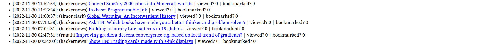
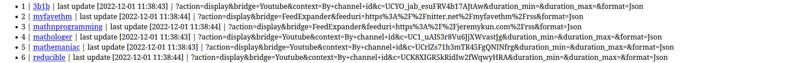
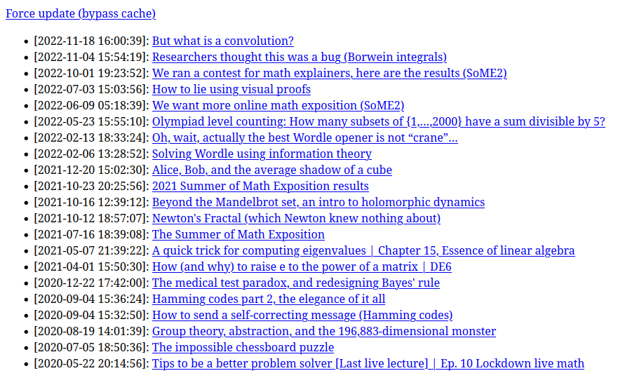

# RSS Feed Reader
Hobby project to aggregate RSS feeds in the browser.

Uses: 
- python
- python flask
- sqlite3
- rss-bridge https://github.com/rss-bridge/rss-bridge/
- docker

Please see https://github.com/FreshRSS/FreshRSS for a fully featured solution.

## Screenshots
See all entries sorted by time

View and add feeds

View entries for each feed in particular

## Run
- If there are any issues with `docker-compose up` try `docker-compose pull` first
    - to update the rss-bridge image do `docker image ls` then `docker pull` the rss-bridge image
- localhost:3000 contains rss-bridge
- localhost:8000 contains app
- URI options can be provided 
    - found at https://github.com/rss-bridge/rss-bridge/wiki/Command-Line-Interface-(CLI)
    - specific params for a bridge found under PARAMETERS in php files in https://github.com/RSS-Bridge/rss-bridge/tree/master/bridges

## To-do
- read/unread and bookmarks
    - toggle view of only unread etc or only bookmarks
- smarten up frontend
- ability to add groups and rss feeds 
    - how to delete a feed - option to delete all past entries or keep them?
- change reddit links to old.reddit?
- often requires reloading or pressing back leads to stale pages - fix this
- search feature?
- stats? Usage? More advanced views of timelines etc for feeds